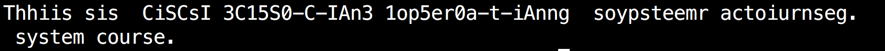

# Shared Output: Example of Mutual Exclusion {#shared-output-example-of-mutual-exclusion}

From the introduction, mutual exclusion restricts only one process to enter a critical section.

`process-1.c`and`process-2.c`are two processes need to display their outputs on the standard error. To ensure the output is right, these two processes should access the standard error exclusively. That is to say, process should wait until the other process that occupies the standard error finishes its display. Otherwise, the output may be confused as figure 1. We use semaphore to ensure mutual exclusion. The result is shown in figure 2.

Comment out semaphore related codes, run these two programs\(proc-1.c,proc-2.c\) and see what happens.



```c
/*process-1.c*/
#include <stdio.h>
#include <stdlib.h>
#include <string.h>
#include <fcntl.h>
#include <sys/stat.h>
#include <semaphore.h>
#include <unistd.h>
int main(int argc, char * argv[]) {

       char * c = "This is CSCI3150--An operating system course.\n";
    // specify no buffering for stderr
    setbuf(stderr, NULL);

       while (* c != '\0') {
            fputc(* c, stderr);
            c++;
            sleep(1);
         }
    return 0;
}
```
  

```c
/*process-2.c*/
#include <stdio.h>
#include <stdlib.h>
#include <string.h>
#include <fcntl.h>
#include <sys/stat.h>
#include <semaphore.h>
#include <unistd.h>
int main(int argc, char * argv[]) {

    char * c = "This is CSCI3150--An operating system course.\n";
    // specify no buffering for stderr
    setbuf(stderr, NULL);  

    while (* c != '\0') {
        fputc(* c, stderr);
        c++;
        sleep(rand()%2+1);
    }
    return 0;
}
```
