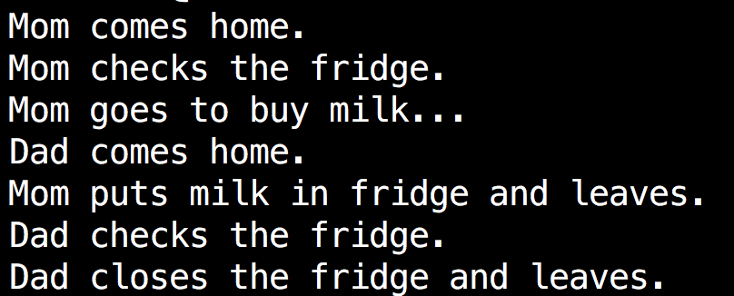
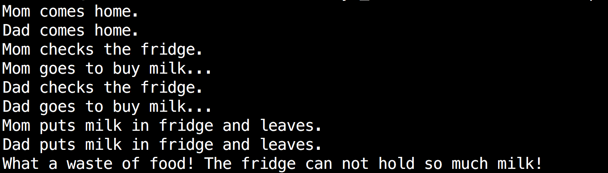

# Too much milk problem. {#too-much-milk-problem}

Your family drink milk every morning. Mom and Dad are all used to checking the fridge when they arrive home. If milk run out, he or she will leave home to buy milk. The fridge is small in your home that only one bottle of milk can be put in it at a time. Mom and Dad always arrive home at different time.

| Time | Dad | Mom |
| :--- | :--- | :--- |
| 3:00 | Arrive Home |  |
| 3:05 | Look in fridge, no milk |  |
| 3:10 | Leave for supermarket |  |
| 3:15 |  | Arrive Home |
| 3:20 | Arrive at Supermarket | Look in fridge, no milk |
| 3:25 | Buy Milk | Leave for supermarket |
| 3:30 | Arrive home, put milk into fridge |  |
| 3:35 |  | Arrive at Supermarket |
| 3:40 |  | Buy milk |
| 3:45 |  | Arrive home, put milk in fridge |
| 3:50 |  | Oh ...... |

Here are two programs simulating the above situation.When process mom or dad buys a bottle of milk, it writes string "milk" to a file fridge \(the file is empty at the beginning\). Run these two programs and see what will happen.

Compile and run like this:

```shell
$ gcc mom.c -o mom
$ gcc dad.c -o dad
$ ./mom & ./dad &
```

```c
/*mom.c*/
#include <stdio.h>
#include <stdlib.h>
#include <string.h>
#include <fcntl.h>
#include <sys/stat.h>
#include <unistd.h>
int main(int argc, char * argv[]) {
    int fd;
    printf("Mom comes home.\n");
    printf("Mom checks the fridge.\n");
    fd=open("fridge", O_CREAT|O_RDWR|O_APPEND, 0777);
    if(lseek(fd,0,SEEK_END)==0){
        printf("Mom goes to buy milk...\n");
        sleep(2);
    write(fd,"milk ",5);
        printf("Mom puts milk in fridge and leaves.\n");
        if(lseek(fd,0,SEEK_END)>5)
            printf("What a waste of food! The fridge can not hold so much milk!\n");
    }else{
        printf("Mom closes the fridge and leaves.\n");
    }
    close(fd);
    return 0;
}
```

```c
/*dad.c*/
#include <stdio.h>
#include <stdlib.h>
#include <string.h>
#include <fcntl.h>
#include <sys/stat.h>
#include <unistd.h>
int main(int argc, char * argv[]) {
    int fd;
    printf("Dad comes home.\n");
    sleep(rand()%2+1);
    printf("Dad checks the fridge.\n");
    fd=open("fridge", O_CREAT|O_RDWR|O_APPEND, 0777);
    if(lseek(fd,0,SEEK_END)==0){
        printf("Dad goes to buy milk...\n");
        sleep(rand()%2+1);
             write(fd,"milk ",5);
        printf("Dad puts milk in fridge and leaves.\n");
        if(lseek(fd,0,SEEK_END)>5)
            printf("What a waste of food! The fridge can not hold so much milk!\n");
    }else{
        printf("Dad closes the fridge and leaves.\n");
    }
    close(fd);
    return 0;
}
```




## Analysis {#analysis}

If we run`mom.c`and`dad.c`many times, we could see different results as shown above. The result of these two programs depends on the order in which the fridge is accessed. This is an example of race condition.

