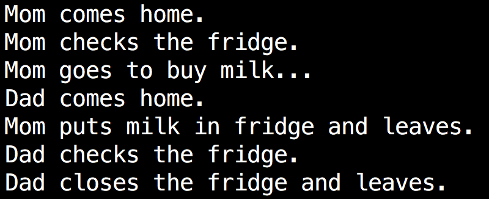

# Too Much Milk : Use Semaphore {#too-much-milk--use-semaphore}

To solve the too much milk problem, mom and dad decide to lock the fridge. There is only one key to open the lock, the one who gets the key can check the fridge. That is to say, if mom gets the key and checks fridge, dad can not open the fridge until mom releases the key. Mom will releases the key until she ensures there is milk in fridge. In mom\_sol.c and dad\_sol.c, we use semaphore to implement the key. Read the following programs and run them to see what will happen.

Note that programs using the POSIX semaphores API must be compiled with -pthread to link against the real-time library. So you need compile these two programs like this:

```shell
$ gcc mom_sol.c -pthread -o mom
$ gcc dad_sol.c -pthread -o dad
$ ./mom & ./dad &
```

```c
/*mom_sol.c*/
#include <stdio.h>
#include <stdlib.h>
#include <string.h>
#include <fcntl.h>
#include <sys/stat.h>
#include <semaphore.h>
int main(int argc, char * argv[]) {
    int fd;
    int VALUE=1;
    sem_t * mutex;
    //If semaphore with name "mutex" does not exist, then create it with VALUE
    mutex = sem_open("mutex", O_CREAT, 0666, VALUE);
    printf("Mom comes home.\n");
    //wait on semaphore "mutex" and decrease it by 1
    sem_wait(mutex);
    printf("Mom checks the fridge.\n");
    //If file "fridge" does not exist, then create it, you can see manual pages for details
    fd=open("fridge", O_CREAT|O_RDWR|O_APPEND, 0777);
    //"fridge" is empty
    if(lseek(fd,0,SEEK_END)==0){
        printf("Mom goes to buy milk...\n");
        sleep(2);
             write(fd,"milk ",5);
        printf("Mom puts milk in fridge and leaves.\n");
        //there is milk in "fridge" already
        if(lseek(fd,0,SEEK_END)>5)
            printf("What a waste of food! The fridge can not hold so much milk!\n");
    }else{
        printf("Mom closes the fridge and leaves.\n");
    }
    //close file "fridge"
    close(fd);
    //add semaphore "mutex" by 1
    sem_post(mutex);
    //Before exit, you need to close semaphore and unlink it, when all  processes have
    //finished using the semaphore, it can be removed from the system using sem_unlink
    sem_close(mutex);
    sem_unlink("mutex");
    return 0;
}
```

```c
/*dad_sol.c*/
#include <stdio.h>
#include <stdlib.h>
#include <string.h>
#include <fcntl.h>
#include <sys/stat.h>
#include <semaphore.h>
int main(int argc, char * argv[]) {
    int fd;
    int VALUE=1;
    sem_t * mutex;
    mutex = sem_open("mutex", O_CREAT, 0666, VALUE);
    printf("Dad comes home.\n");
    sleep(rand()%2+1);
    sem_wait(mutex);
    printf("Dad checks the fridge.\n");
    fd=open("fridge", O_CREAT|O_RDWR|O_APPEND, 0777);
    if(lseek(fd,0,SEEK_END)==0){
        printf("Dad goes to buy milk...\n");
        sleep(rand()%2+1);
             write(fd,"milk ",5);
        printf("Dad puts milk in fridge and leaves.\n");
        if(lseek(fd,0,SEEK_END)>5)
            printf("What a waste of food! The fridge can not hold so much milk!\n");
    }else{
        printf("Dad closes the fridge and leaves.\n");
    }
    close(fd);
    sem_post(mutex);
    sem_close(mutex);
    sem_unlink("mutex");
    return 0;
}
```



## Analysis {#analysis}

Only one key ensures mom and dad will not operate on the fridge at the same time \(mutual exclusion\). That means while mom handles with fridge \(in critical region\), dad should wait until mom finishes \(leaves the critical region\). We regard mom and dad as two processes, then fridge is a shared resource \(we use file to implement it\) between these two processes and semaphore is the key. The value of semaphore is the number of keys. When a semaphore has only two values, 0 and 1, it is usually used to achieve mutual exclusion.

